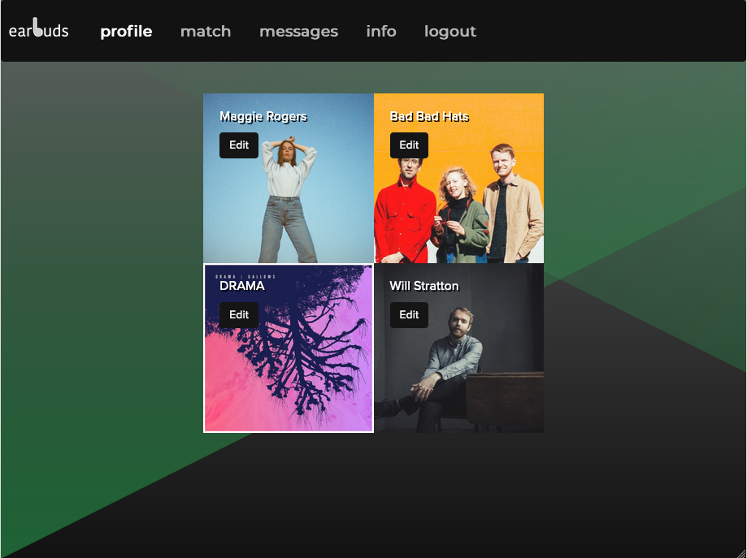
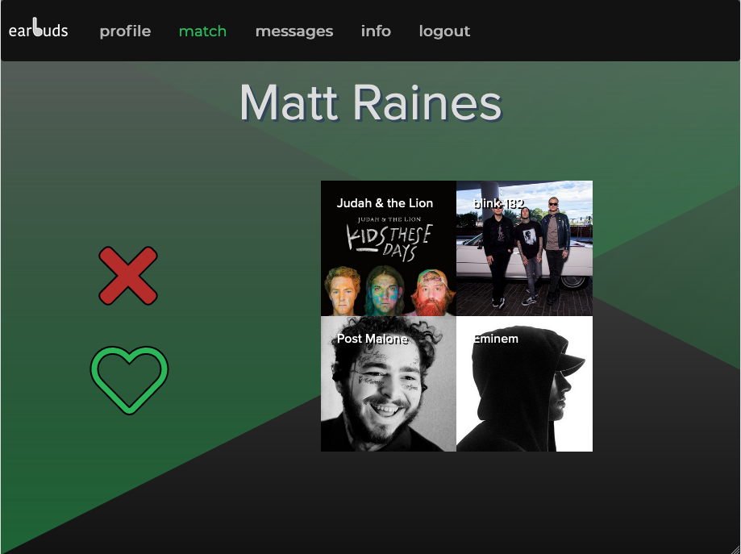
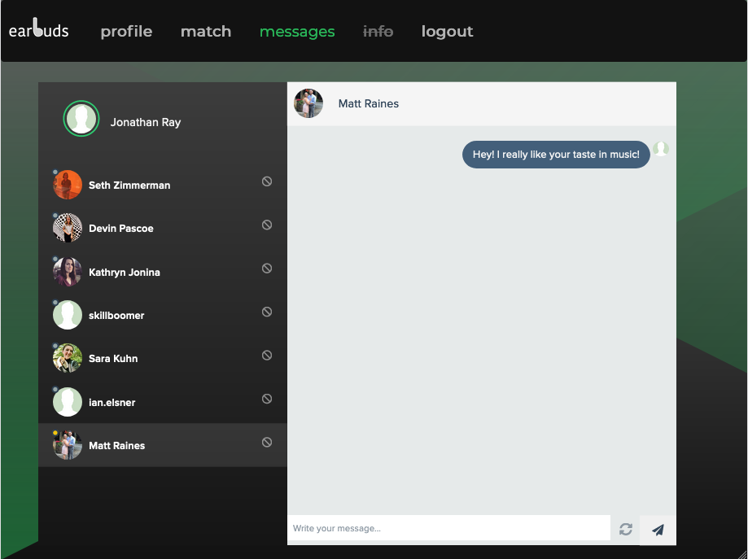

# Ear Buds

<h3 align="center"><a href="https://earbuds.jonathan-ray.com">Live site</a></h3>

## Contents
    -Description
    -Features
    -Technologies
    -Challenges and Solutions
    -MVP
    -Stretch Goals
    -Authors
    -Screenshots

## Decription
“EarBuds” is where music and online profile matching collide. This full-stack application allows you to log in to your proile, edit your top artists, and connect with other users where you can chat and share different music!

### Features
* A splash page is loaded with a timeout that will redirect you to sign in with Spotify.
* If you are already logged in, it will let you past the login process.
* The profile page auto-populates your top artists based on your Spotify activity.
* You can change your top artists in the database at any time based on artists in the Spotify library.
* The match page will pull other users' top artists and allows you to click the "heart" if you want to connect, or the "X" if you want to skip them.
* When you are out of matches, or have no one with whom you are matched, you will get a modal telling you such and redirected to the appropiate page.
* The messages page shows you everyone you have connected with and allows you to message back and forth with them in a dynamic way just shy of real-time. (Any activity on the page refreshes the content.)
* This also incorporates status icons based on the last time another user logged in.
* The messages tab within the site navigation features a notification icon whenever you have a message that was sent since the last time you checked your messages.
* Additionally, the messages page defaults to your most recently active conversation.
* Lastly, it allows you to block users and it will remove that conversation on both your page as well as the other user's page.

## Technologies
* HTML
* CSS
* Javascript
* Spotify API
* PostgreSQL
* Node.js
* Express
* ES6 Renderer
* Passport.js

## Challenges and Solutions
* Showing peoples connections on the messaging page without a conversation already started proved to be difficult early on. This was handled by adding a seed message to a converstation each time a connection was made. We had the user that made the connection automatically send `Hey, I really like your taste in music!`.

    Not only did this allow us to put that conversation in the messaging page, but it also got the converstation rolling for the two users, making this a pretty neat feature.

* Creating a dynamic chat experience that didn't rely on more advanced/conventional technologies (ie React) was _grueling._ The underlying mechanism for sending and receiving messages from a PostGreSQL database was pretty straightforward but creating features that the enduser is used to in other chat clients (such as loading the conversation with the most recent message first, away/busy/online statuses, et cetera) and implementing them within a Bootstrap template proved to be a lot of juggling.
    
    Breaking each of these features into individual status variables and passing them into the `local` variables during the view engine's rendering of the page allowed us to tackle the problems individually and flood the page with ternary operators for simple decision making, leading to a more dynamic experience.

## MVP
* Create a full-stack friend finder using Spotify music.
* Requirements
    * Users can change their top artists to display
    * Users are able to click like or skip on each potential match.
    * Messaging is allowed between the matched users.

## Stretch Goals
* Provide 30 second snippets of music when you click on another users artist.
    * Completed (albeit with edge-cases that are handled with a default track)
* Creating pre-populated playlists between matched users based on their artists.
    * Incomplete
* Requiring both users to agree to match before they are connected.
    * Incomplete
* Having status icons next to conversations to show when they were last online.
    * Completed

## Authors
* Matt Raines
    * Primary Contributions:
        * Concept, SQL Queries, Matching Integration, Form Submission, Routing
    
    [GitHub Profile](https://github.com/mraines4)

* Jonathan Ray
    * Primary Contributions:
        * Concept, Spotify API Integration, Messaging Integration, Form Submission, Routing
    
    [GitHub Profile](https://github.com/ray-jonathan)

## Screenshots
* Desktop

* Mobile

